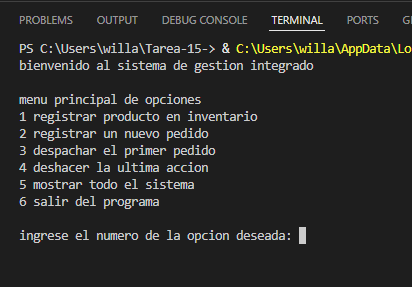
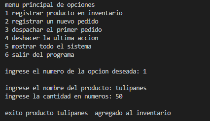
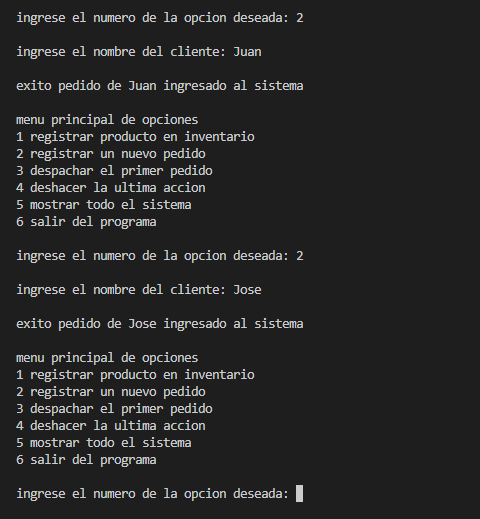
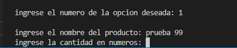
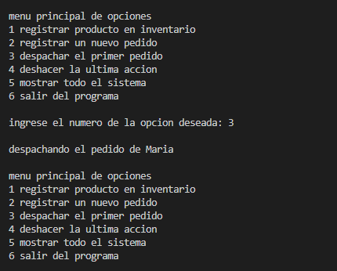

# Tarea-15-

Funcionalidades del sistema
El programa funciona con un menú interactivo de seis opciones, permite registrar nuevos productos con su cantidad, agregar clientes a una fila de espera, despachar el pedido más antiguo, deshacer la última acción si te equivocaste, ver un reporte en vivo de todo lo guardado y cerrar el sistema de forma segura.

Estructuras de datos utilizadas
Lista enlazada para el inventario, resuelve el problema de memoria limitada, se usa porque permite agregar productos nuevos infinitamente sin tener que definir un tamaño máximo desde el principio.

Cola para los pedidos.
Resuelve el problema de la logística y organización, se usa porque sigue la regla de primero en entrar, primero en salir, asegurando que los clientes sean atendidos exactamente en el orden en que llegaron.

Pila para el historial.
Resuelve el problema de corregir errores humanos porque sigue la regla de último en entrar, primero en salir, lo que es perfecto para un botón de deshacer, borrando solo el último paso que dio el usuario.

Pruebas:

